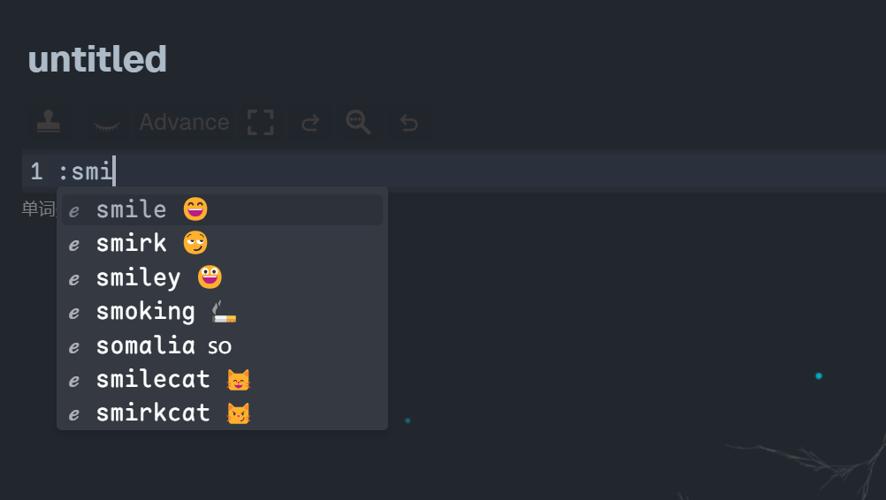
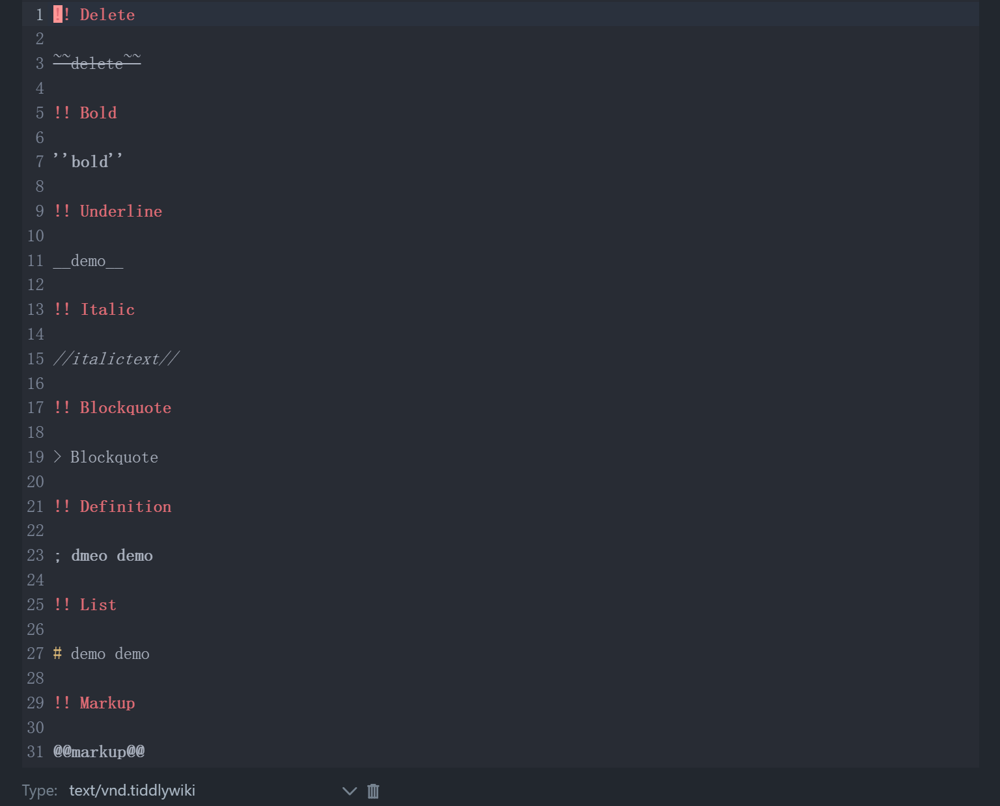
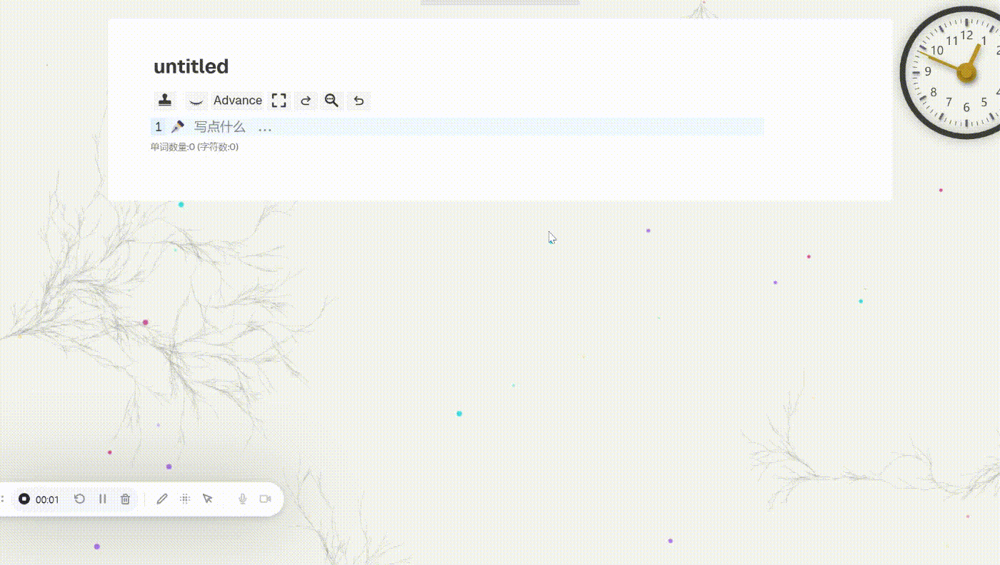
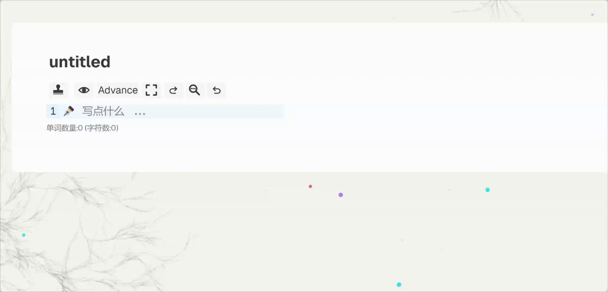
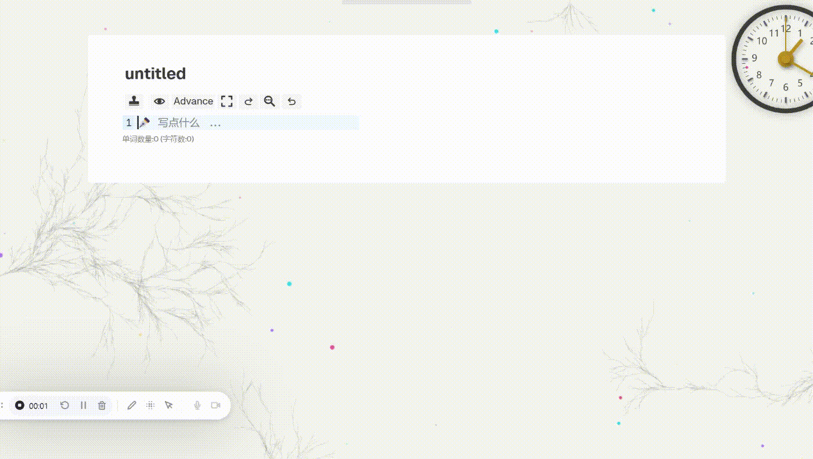
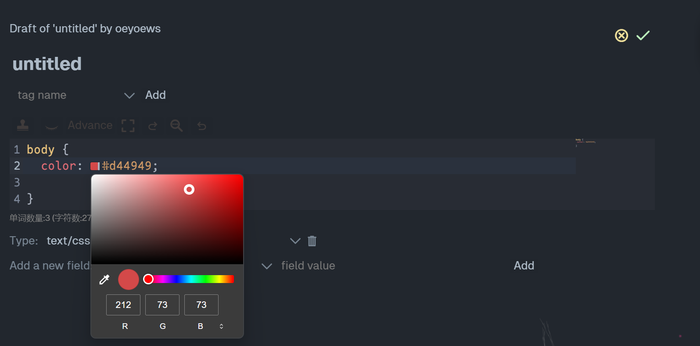
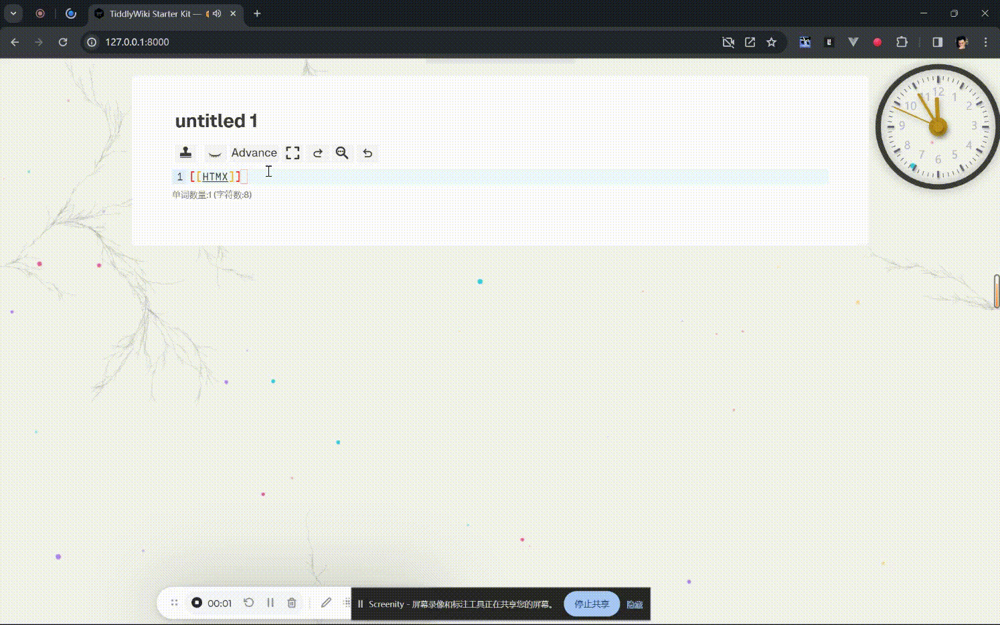

<!--
This README provides an overview of the `tiddlywiki-codemirror-6` plugin, which has entered maintenance mode as of 2024-01-24. The plugin focuses on bug fixes and compatibility improvements, with no major changes planned. A minimal version of the plugin is available in the `basic` branch.

### Key Features
- **Emoji Completion**: Provides emoji suggestions for enhanced text editing.
- **Wiki Mode**: Enables a specialized mode for editing TiddlyWiki content.
- **Code Snippet Completion**: Offers auto-completion for code snippets.
- **Tiddler Completion**: Facilitates linking and referencing TiddlyWiki tiddlers.
- **Widget Completion**: Assists in inserting and editing widgets.
- **Image Completion**: Simplifies adding and managing images.
- **Color Customization**: Allows users to modify colors dynamically.
- **Link Preview**: Displays previews for links within the editor.

### File Structure
The project is organized into multiple directories, including:
- `config`: Configuration files for the plugin.
- `modules`: Contains completions, constants, extensions, and keymaps.
- `tiddlers`: Includes auto-generated configurations, icons, macros, palettes, shortcuts, and UI components.
- `types`: Type definitions for the plugin.
- `utils`: Utility functions and helpers.

### Development
To contribute or debug the plugin locally:
1. Clone the repository with `git clone --depth 1`.
2. Install dependencies using `pnpm install`.
3. Use `pnpm dev` for local debugging or `pnpm build` to build the plugin.

### Demos
- **StackBlitz Demo**: A live demo showcasing the plugin's features.
- **Vercel Demo**: Hosted demo for testing the plugin.
- **GitHub Pages Demo**: Another hosted demo for plugin exploration.

### Badges
Dynamic JSON badges are included to display the current version of the plugin.

For more details, refer to the repository's documentation and explore the provided demos.
-->
<!-- > [!IMPORTANT]
> tiddlywiki-codemirror-6 插件进入维护状态，接下来主要修复 BUG, 提升插件的兼容性，整体上不会再进行大的改动 (2024-01-24). 如果你想要查看最小版本的 tiddlywiki-codemirror-6 插件，请查看 `basic` 分支。 -->

> [!IMPORTANT]
> The tiddlywiki-codemirror-6 plugin has entered maintenance status. Next, we will mainly fix bugs and improve the compatibility of the plugin. No major changes will be made overall (2024-01-24). If you want to view the smallest version of tiddlywiki-codemirror-6 plugin, please check out the `basic` branch.

[stackblitz codemirror6 demo](https://stackblitz.com/~/github.com/oeyoews/tiddlywiki-codemirror6)

https://user-images.githubusercontent.com/72405338/294956491-948b791f-04e1-4447-a5d3-81ebb13619de.mp4


## Preview

- [vercel demo](https://tiddlywiki-codemirror6.vercel.app) or [gh-page demo](https://oeyoews.github.io/tiddlywiki-codemirror6)

| Emoji 补全                   | Wiki Mode                           | 代码片段补全                               |
| ---------------------------- | ----------------------------------- | ------------------------------------------ |
|  |  |  |

| tiddler 补全               | widget 补全                    | 图片补全                     |
| -------------------------- | ------------------------------ | ---------------------------- |
|  |  |  |

| 颜色修改                     | Link 预览                                 |
| ---------------------------- | ----------------------------------------- |
|  |  |

## FileStruct

```
📦tiddlywiki-codemirror-6
 ┣ 📂config
 ┣ 📂modules
 ┃ ┣ 📂completions
 ┃ ┃ ┣ 📂sources
 ┃ ┣ 📂constants
 ┃ ┣ 📂extensions
 ┃ ┃ ┣ 📂inlineSuggestion
 ┃ ┣ 📂keymap
 ┣ 📂tiddlers
 ┃ ┣ 📂auto-generated-config
 ┃ ┣ 📂icons
 ┃ ┣ 📂lib
 ┃ ┃ ┣ 📂editor
 ┃ ┃ ┃ ┗ 📂operations
 ┃ ┃ ┗ 📂subclasses
 ┃ ┃ ┃ ┣ 📂editor
 ┃ ┣ 📂macros
 ┃ ┣ 📂palettes
 ┃ ┣ 📂Shortcuts
 ┃ ┃ ┗ 📂fullscreen
 ┃ ┃ ┃ ┣ 📂ShortcutInfo
 ┃ ┃ ┃ ┗ 📂shortcuts
 ┃ ┣ 📂ui
 ┃ ┃ ┣ 📂ControlPanel
 ┃ ┃ ┣ 📂EditorToolbar
 ┃ ┃ ┣ 📂EditorTools
 ┃ ┃ ┣ 📂EditTemplate
 ┃ ┃ ┗ 📂Templates
 ┣ 📂types
 ┣ 📂utils
```

## Dev

```shell
git clone --depth 1 https://github.com/oeyoews/tiddlywiki-codemirror6
cd tiddlywiki-codemirror6
pnpm install ## add dependencies
pnpm dev  ## local debug plugins
pnpm build  ## build codemirror6 plugins
```
